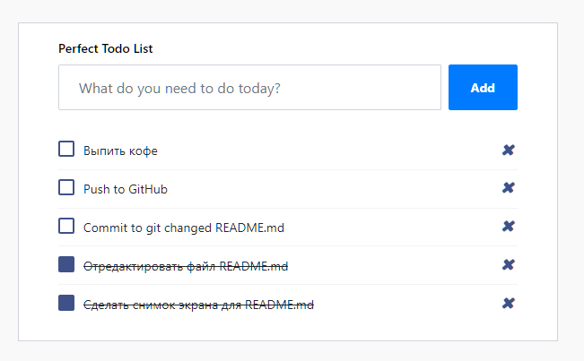

TODO list REST service
======================

Back-end
--------
- REST API based on Flask
- SQLite with SQLAlchemy
- JSON serialize with Marshmallow

Front-end
---------
- Vue JS with Axios
- Bootstrap 4.0.0

---
_REST-server start on port 5000_

_Test WEB-server start on port 80_

---

```
Get all tasks: GET /todo/api/v1.0/tasks
Get task by ID: GET /todo/api/v1.0/tasks/<int:task_id>
Add new task: POST /todo/api/v1.0/tasks, json={'title': 'test task'}
Update task: PUT /todo/api/v1.0/tasks/<int:task_id>, json={'done': 'True'}
Delete task: DELETE /todo/api/v1.0/tasks/<int:task_id>
```

